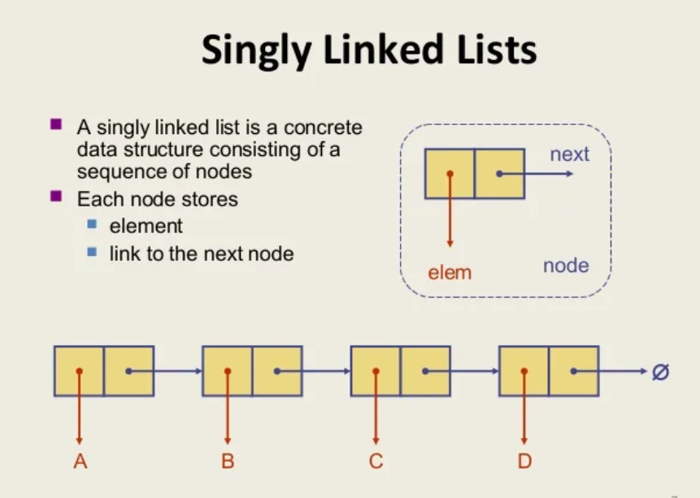
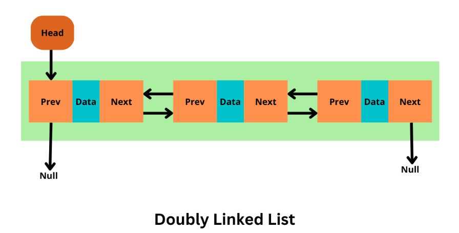
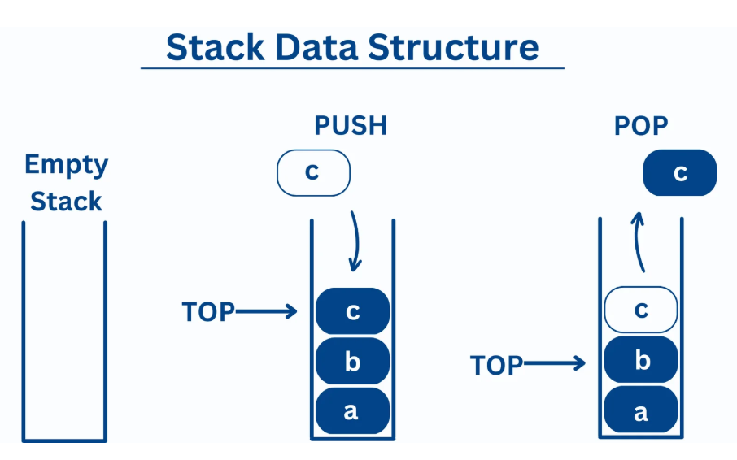
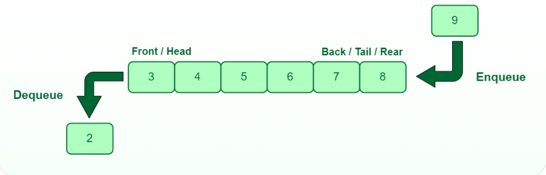

# 📘 Data Structures and Algorithms Notes

---

## 1. Single Linked List


```
class Node {
    int data;
    Node next;
    Node(int data) {
        this.data = data;
        this.next = null;
    }
}
```


## Double Linked List
```
class DNode {
    int data;
    DNode prev;
    DNode next;
    DNode(int data) {
        this.data = data;
        this.prev = null;
        this.next = null;
    }
}
```


--------------------
## Stack

### Push: Insert element at the top 
```
 public void push(int x) { if (top == capacity - 1) 
{ 
    System.out.println("Stack Overflow"); 
    return; 
} 
    arr[++top] = x; 
    System.out.println("Inserted " + x); 
}
```

### Pop: Remove element from the top
```
    public int pop() {
        if (empty()) {
            System.out.println("Stack Underflow");
            return -1;
        }
        return arr[top--];
    }
```

### Empty: Check if stack is empty
```
    public boolean empty() {
        return top == -1;
    }

```
### Peek: Return top element without removing
```
    public int peek() {
        if (empty()) {
            System.out.println("Stack is empty");
            return -1;
        }
        return arr[top];
    }
```


-------------------------------------

## Queue

 ### Check if queue is empty
 ```
    public boolean isEmpty() {
        return count == 0;
    }
```

### Check if queue is full
```
    public boolean isFull() {
        return count == capacity;
    }
```

### Enqueue: Insert element at the rear
```
    public void enqueue(int x) {
        if (isFull()) {
            System.out.println("Queue Overflow - cannot insert " + x);
            return;
        }
```

### Dequeue: Remove element from the front
```
    public int dequeue() {
        if (isEmpty()) {
            System.out.println("Queue Underflow - cannot remove");
            return -1;
        }
```



------------------------------------

## Big O Notation

### O(1): Constant time
```
System.out.println("Hello"); // executes once
```
```
x= 2;
```

### O(n): Linear time
```
for (int i = 0; i < n; i++) {
    System.out.println(i);
}
```

### O(n^2): Quadratic time

```
for (int i = 0; i < n; i++) {
    for (int j = 0; j < n; j++) {
        System.out.println(i + "," + j);
    }
}
```

### O(n log n): Log-linear time

```
for (int i = 1; i < n; i *= 2) {
    for (int j = 0; j < n; j++) {
        System.out.println(i + "," + j);
    }
}
```

## Searching

### Linear Search: 
Traverse the array sequentially until the target is found.
```
Complexity: O(n)
```

### Binary Search: 
Efficient search on sorted arrays by repeatedly dividing the search interval in half.

```
Complexity: O(log n)
```
## Sorting

### Bubble Sort

Time Complexity of Bubble Sort
Best Case (already sorted array):
```
O(n) → Only one pass is needed, no swaps.
```

----------------------
Average Case:
```
O(n²) → Nested loops compare and swap elements.
```
------------------------
Worst Case (reverse sorted array):
```
O(n²) → Every element needs to be compared and swapped.
```
--------------------------
📊 Space Complexity

O(1) → Bubble Sort is an in-place algorithm, meaning it doesn’t require extra memory beyond a few variables.