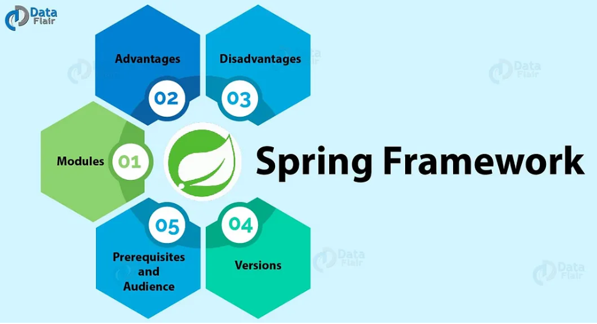

# 🌱 Spring Framework Overview

## 1. Spring Framework Overview
Spring is a powerful, lightweight framework for building enterprise-level Java applications.  
It provides comprehensive infrastructure support for developing Java applications, enabling developers to focus on business logic rather than boilerplate code.  
Key features include:
- Dependency Injection (DI) and Inversion of Control (IoC)
- Aspect-Oriented Programming (AOP)
- Transaction management
- Integration with various data access technologies (JDBC, JPA, Hibernate)
- Support for building web applications and REST APIs

---

## 2. Benefits of Spring
Spring offers several advantages that make it one of the most popular frameworks in the Java ecosystem:
- **Loose coupling**: Achieved through Dependency Injection.
- **Modularity**: Developers can use only the parts they need.
- **Testability**: Simplifies unit testing with mock objects and DI.
- **Integration**: Works seamlessly with other frameworks and libraries.
- **Community support**: Large ecosystem and active community.
- **Productivity**: Reduces boilerplate code, speeding up development.

---

## 3. Spring vs Spring Boot
| Feature                | Spring Framework | Spring Boot |
|-------------------------|------------------|-------------|
| **Setup**              | Requires manual configuration | Provides auto-configuration |
| **Boilerplate Code**   | More verbose | Minimal, streamlined |
| **Deployment**         | Traditional WAR files | Embedded server (Tomcat, Jetty) |
| **Learning Curve**     | Steeper | Easier for beginners |
| **Focus**              | General-purpose framework | Rapid application development |

**Summary:**  
Spring Boot builds on top of Spring, simplifying setup and configuration. It’s designed to get applications running quickly with minimal effort.

---

## 4. Auto-Configuration Concept
Auto-configuration is a key feature of Spring Boot.  
It automatically configures application components based on the dependencies present in the classpath.  

For example:
- If `spring-boot-starter-web` is included, Spring Boot configures an embedded Tomcat server and sets up Spring MVC.
- If `spring-boot-starter-data-jpa` is present, it configures a DataSource, EntityManagerFactory, and transaction management.

This reduces the need for manual configuration and allows developers to focus on writing business logic.

---

## 5. Conclusion
- Spring provides a robust foundation for enterprise applications, while Spring Boot enhances developer productivity with auto-configuration and embedded servers.  
Together, they form a powerful ecosystem for modern Java development.
